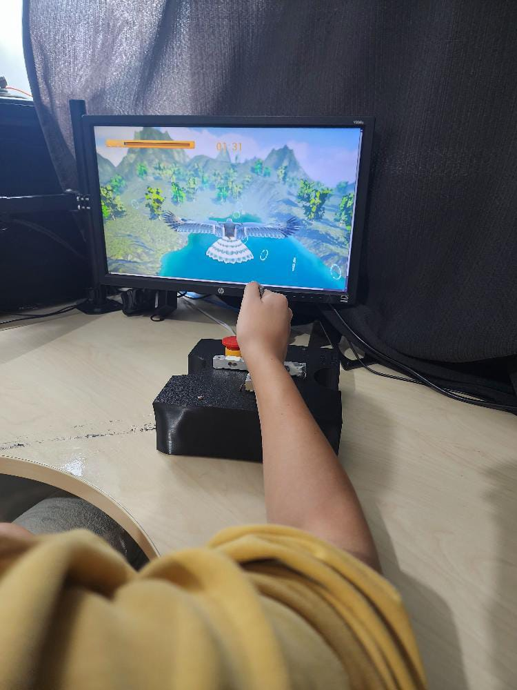

# ARMOVE - Omnidirectional Robotic Device for Upper Limb Rehabilitation

[](https://opensource.org/licenses/MIT)

**Author:** Pedro Netto Gandolfi Grangeiro 
**Advisor:** Prof. Dr. Fabricio Noveletto 
**Institution:** Universidade do Estado de Santa Catarina (UDESC) 
**Course:** Bachelor's in Electrical Engineering 

This repository contains all the necessary files and documentation for the ARMOVE project, an active omnidirectional robotic device for the gross motor function rehabilitation of the upper limb. The project was developed as a Final Coursework (TCC) for the Bachelor's degree in Electrical Engineering at UDESC, Joinville.

---

## 📖 Overview

Motivated by the significant impact of Stroke (CVA) and the high cost of conventional robotic therapies, this project aimed to develop a low-cost, open-source, omnidirectional prototype for the active rehabilitation of the upper limb. 
The device, functionally inspired by the commercial Armotion system, allows a patient to control its movement by applying force to a handle.  It uses a set of Mecanum wheels for omnidirectional mobility and a force-sensing system to interpret the user's intent.  The processed data is then used to move the robot and can be simultaneously transmitted via Bluetooth to a computer, emulating a mouse for interaction with therapeutic games (gamification).

This work delivers a validated, open-source platform, demonstrating the feasibility of more accessible assistive technologies and inviting multidisciplinary collaboration for its evolution into a complete clinical tool.

<div align="center">
  
</div>

## ✨ Features

* **Omnidirectional Movement:** Utilizes four Mecanum wheels driven by NEMA 17 stepper motors, allowing for fluid, planar movement in any direction (X-Y plane) without needing to reorient the chassis. 
* **Force-Based Active Control:** The robot operates in an active mode, where the speed and direction of movement are proportional to the force applied by the user on a central joystick. 
* **Smooth Motion Profile:** Implements a non-linear, sigmoidal control law using a hyperbolic tangent (`tanh`) function to ensure smooth acceleration and deceleration, enhancing patient safety and comfort. 
* **Real-Time Processing:** Built on an ESP32 microcontroller running the FreeRTOS real-time operating system, guaranteeing responsive and deterministic control. 
* **Wireless Connectivity:** Features Bluetooth Low Energy (BLE) to connect to external devices, emulating a Human Interface Device (HID) mouse for immediate visual feedback and interaction with rehabilitation software. 
* **Open Source:** All design files, including firmware source code, 3D models for the chassis, and electronic diagrams, are publicly available to encourage collaboration and further development.

## 🛠️ Hardware

The prototype integrates the following key components:

| Component | Model/Type | Function |
| :--- | :--- | :--- |
| **Microcontroller** | ESP32-WROOM-32 | Central processing unit, managing sensors, motors, and BLE communication.  |
| **Actuators** | 4x NEMA 17 Stepper Motors | Provide high-torque, precise movement for the wheels.  |
| **Motor Drivers** | 4x A4988 | Control the current and stepping of the NEMA 17 motors.  |
| **Wheels** | 4x 60mm Mecanum Wheels | Enable omnidirectional movement. |
| **Force Sensors** | 4x Micro Load Cells (CZL635) | Measure the force applied by the user in the X and Y axes. |
| **Sensor Amplifiers** | 4x HX711 ADC Modules | Amplify and convert the analog signal from the load cells to a 24-bit digital value. |
| **Power System** | 5S Li-ion Battery Pack (21V) with BMS | Powers the entire system safely. |
| **Voltage Regulator** | LM2596 DC-DC Buck Converter | Steps down the battery voltage for the microcontroller and logic circuits. |
| **Chassis** | Custom 3D Printed (PLA) | Houses all electronic and mechanical components. |

### Electrical Diagram
The complete electrical schematic detailing the interconnections between all components can be found at the link below.
[Electrical Diagram](https://github.com/pedronetto12/ARMOVE-RehabilitationRobot/blob/main/img/Schematic_tccpedronetto_2025-07-16.png)

## 💻 Software

The embedded software is built using the **PlatformIO** framework within VSCode. This ensures a reproducible build environment by managing exact versions of libraries and the ESP32 hardware platform (`espressif32@6.2.0`). 

### Architecture
The architecture is modular and built upon the **FreeRTOS** real-time operating system to handle concurrent tasks efficiently. 
* **Key Modules:**
    * `celulas.h`: Manages data acquisition and processing from the HX711 load cells.
    * `motor.h`: Handles the control logic, kinematics, and pulse generation for the stepper motors.
    * `robomouse.h`: Manages the BLE connection and HID mouse emulation.
* **Real-Time Tasks:**
    1.  **Motor Control (`ContrMotores`):** A high-priority task running every 2 ms to ensure fluid motor updates.
    2.  **Sensor Reading (`atuador`):** A task dedicated to reading and processing data from the load cells.
    3.  **Bluetooth (`ContrMouse`):** A lower-priority task that sends cursor movement data over BLE.
    4.  **LED Status (`ledTask`):** A simple task to provide visual feedback on the system's state.

The source code is located in the `/include` directory and is organized into the modules described above. The full source code can also be found in Appendix A of the thesis.

## ⚙️ Installation & Setup

1.  **Clone the Repository:**
    ```bash
    git clone [https://github.com/pedronetto12/ARMOVE-Rehabilitation-Robot.git](https://github.com/pedronetto12/ARMOVE-Rehabilitation-Robot.git)
    cd ARMOVE-Rehabilitation-Robot
    ```
2.  **Hardware Assembly:** Assemble the mechanical and electronic components according to the electrical diagram and 3D models. The 3D models (`.stl` files) for printing are available in the `/3d_models` directory.
3.  **Software Environment:**
    * Install [Visual Studio Code](https://code.visualstudio.com/).
    * Install the [PlatformIO IDE extension](https://platformio.org/platformio-ide) from the VSCode marketplace.
4.  **Build and Upload:**
    * Open the cloned repository folder in VSCode.
    * PlatformIO will automatically detect the `platformio.ini` file and prompt you to install the required libraries and toolchains.
    * Connect the ESP32 to your computer.
    * Build and upload the firmware using the PlatformIO toolbar (click the "Upload" arrow icon).

## 🎛️ Calibration

Before operation, two critical calibration procedures must be performed to ensure accuracy and safety.

### 1. A4988 Stepper Driver Calibration
This procedure sets the maximum current for the stepper motors to prevent overheating.

1.  **Calculate V_REF:** The target current was set to **1.0A** (80% of the motor's 1.3A rating).  With 0.1Ω sense resistors on the A4988 modules, the target reference voltage (V_REF) is **0.8V (800mV)**. 
2.  **Adjust Potentiometer:**
    * Power the logic and motor circuits. **Do not connect the motors yet.** 
    * Using a multimeter, measure the voltage between the `GND` pin and the metal top of the potentiometer on one of the A4988 drivers.
    * Slowly turn the potentiometer with a small screwdriver until the multimeter reads **0.800V**. 
    * Repeat this process for all four drivers.

### 2. Load Cell (HX711) Calibration
This procedure determines the calibration factor needed to convert the raw ADC readings into grams.

1.  **Load Calibration Sketch:** Use a standard HX711 calibration sketch (like the one found in the `HX711_ADC` library examples).
2.  **Run the Procedure:**
    * Upload and run the sketch on the ESP32 with the load cells connected.
    * Open the Serial Monitor. Follow the on-screen instructions.
    * First, the program will perform a tare (zeroing) with no weight on the platform.
    * Next, place a **known weight** (e.g., 5 kg) on the sensor platform.
    * Enter the known weight value (e.g., `5000.0` for grams) into the serial monitor.
    * The sketch will calculate and display a new calibration factor.
3.  **Update Firmware:** Record the calibration factors for each of the four load cells and update the following `#define` constants in `/indlude/celulas.h`:
    ```cpp
    #define calValueCellXp 43.53 // Replace with your value
    #define calValueCellXn 41.06 // Replace with your value
    #define calValueCellYp 43.22 // Replace with your value
    #define calValueCellYn 43.50 // Replace with your value
    ```

## ▶️ How to Operate

1.  **Power On:** Turn on the main power switch. The onboard LED will blink during initialization.
2.  **Ready State:** The LED will turn solid, indicating that initialization is complete and the device is ready. The BLE service is now advertising.
3.  **Connect via Bluetooth:** On a computer, search for Bluetooth devices and pair with **"Rehabilitation Robot"**. The device will be recognized as a standard mouse.
4.  **Begin Therapy:**
    * Place the robot on a flat, smooth surface.
    * The user places their hand on the joystick/handle and applies force in the desired direction of movement.
    * The robot will move across the surface, and the computer's cursor will move in sync, allowing interaction with games or other rehabilitation software.

## 🚧 Limitations & Future Work

While the prototype successfully validates the core concept, several limitations were identified that pave the way for future improvements.

### Current Limitations
* **Active Mode Only:** The current design is only suitable for patients who can actively generate force. It does not support passive (robot-led) or active-assistive modes for patients with more severe impairment.
* **Rotational Drift:** The device experiences minor, unintentional rotations around its central axis during movement, which can accumulate over time.
* **Sensor Drift:** The load cells can exhibit drift and hysteresis, especially under traction forces, preventing a perfect return to zero.

### Future Development Roadmap
The evolution of this project depends on a multidisciplinary effort. Key areas for future work include:

1.  **Hardware Enhancements:**
    * **Orientation Control:** Integrate an Inertial Measurement Unit (IMU) (e.g., MPU6050) to implement a closed-loop control system that corrects rotational drift.
    * **Passive/Assistive Modes:** Add encoders to the motors for position feedback, enabling the implementation of passive and active-assistive therapeutic modes.
    * **Sensor Redesign:** Explore bidirectional force sensors or a new mechanical arrangement to eliminate sensor drift.
2.  **Software Development:**
    * **Gamification Suite:** Develop a dedicated suite of therapeutic games that leverage the device's IHM for engaging and measurable rehabilitation exercises.
3.  **Clinical Validation:**
    * Collaborate with physiotherapists and occupational therapists to conduct usability tests and controlled clinical trials to validate the device's therapeutic effectiveness.

## 🤝 How to Contribute

This is an open-source project, and contributions are highly welcome! To contribute:

1.  Fork the repository.
2.  Create a new branch (`git checkout -b feature/YourFeature`).
3.  Commit your changes (`git commit -m 'Add some feature'`).
4.  Push to the branch (`git push origin feature/YourFeature`).
5.  Open a Pull Request.

Please open an issue to discuss any major changes you would like to make.

## 📜 License

This project is licensed under the MIT License. See the [LICENSE](LICENSE.md) file for details.
